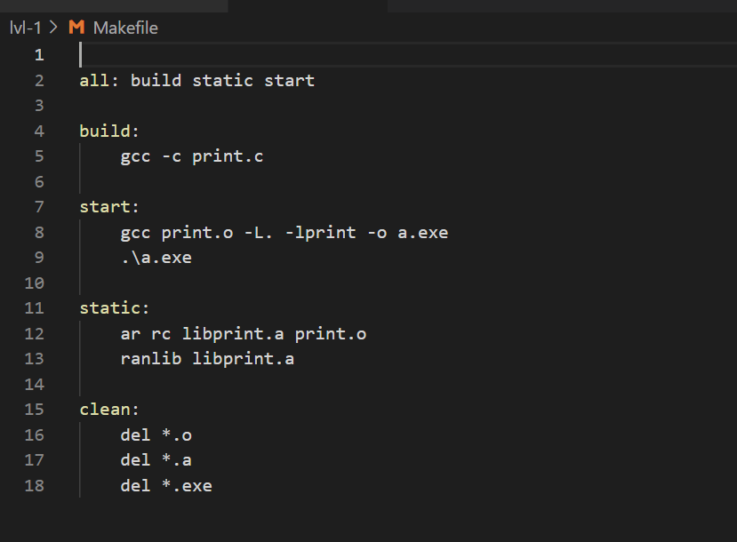
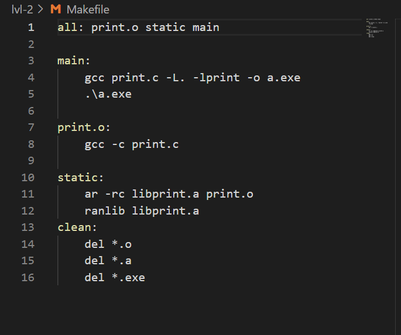
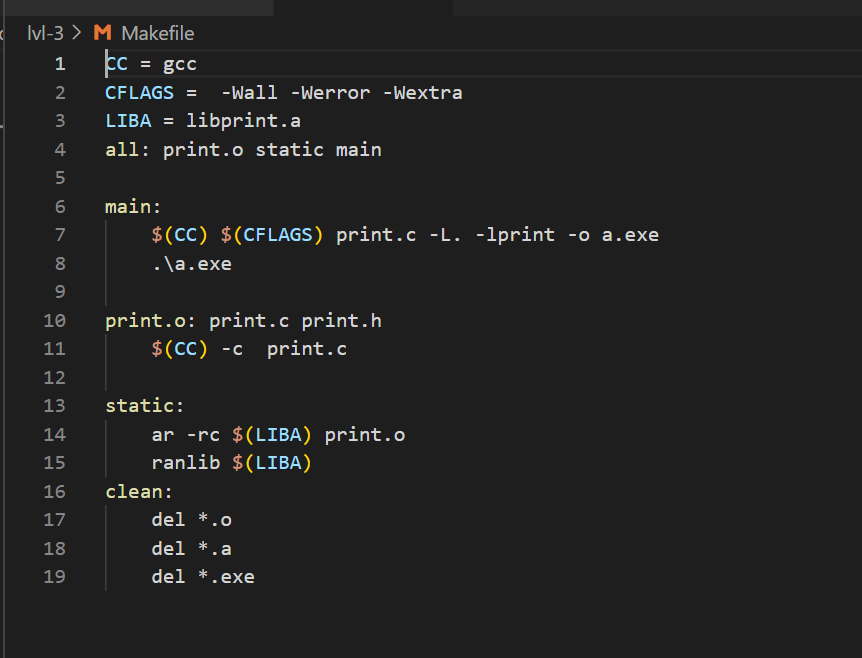
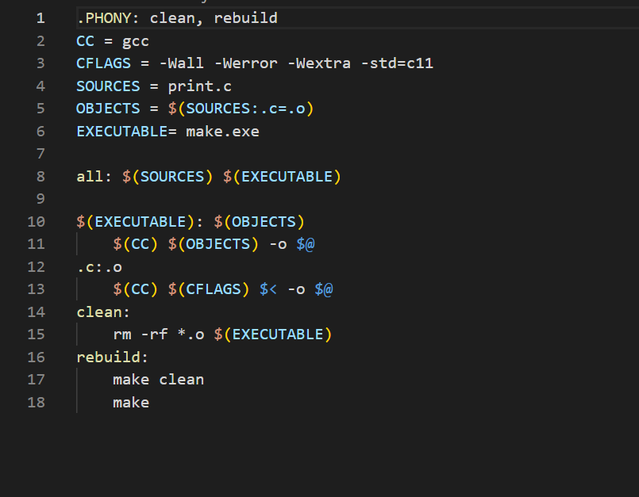
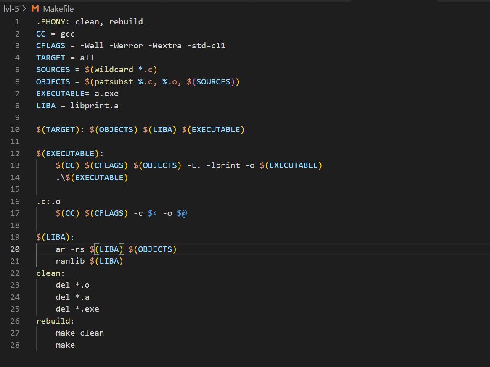

# Makefile

Ways of write a Makefile.

## Contents
0. [Preamble](#preamble)
1. [Part I](#part-1)
2. [Part II](#part-2)
3. [Part III](#part-3)
4. [Part IV](#part-4)
5. [Part V](#part-5)

## Preamble

> Makefile - it is a file containing a set of instructions  applicable to the use of the build tool.

## Part 1
- Wriete a Makefile five different ways

**== Task ==**

## Part 2

**== Task ==**

## Part 3

**== Task ==**

## Part 4

**== Task ==**

## Part 5

**== Task ==**

